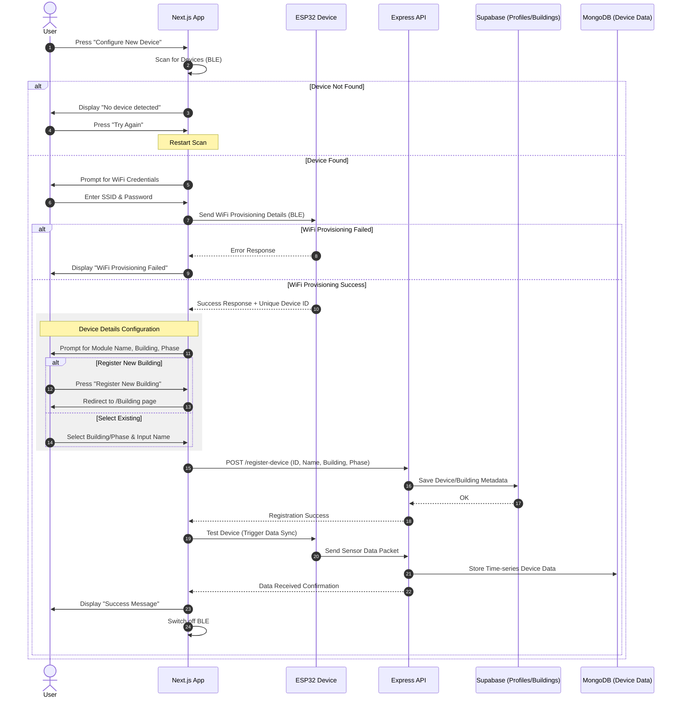

```mermaid
sequenceDiagram
    autonumber
    actor User
    participant App as Next.js App
    participant ESP32 as ESP32 Device
    participant Backend as Express API
    participant Supabase as Supabase (Profiles/Buildings)
    participant MongoDB as MongoDB (Device Data)

    User->>App: Press "Configure New Device"
    App->>App: Scan for Devices (BLE)
    
    alt Device Not Found
        App->>User: Display "No device detected"
        User->>App: Press "Try Again"
        Note over App: Restart Scan
    else Device Found
        App->>User: Prompt for WiFi Credentials
        User->>App: Enter SSID & Password
        App->>ESP32: Send WiFi Provisioning Details (BLE)
        
        alt WiFi Provisioning Failed
            ESP32-->>App: Error Response
            App->>User: Display "WiFi Provisioning Failed"
        else WiFi Provisioning Success
            ESP32-->>App: Success Response + Unique Device ID
            
            rect rgb(240, 240, 240)
                Note over User, App: Device Details Configuration
                App->>User: Prompt for Module Name, Building, Phase
                alt Register New Building
                    User->>App: Press "Register New Building"
                    App->>User: Redirect to /Building page
                else Select Existing
                    User->>App: Select Building/Phase & Input Name
                end
            end

            App->>Backend: POST /register-device (ID, Name, Building, Phase)
            Backend->>Supabase: Save Device/Building Metadata
            Supabase-->>Backend: OK
            Backend-->>App: Registration Success
            
            App->>ESP32: Test Device (Trigger Data Sync)
            ESP32->>Backend: Send Sensor Data Packet
            Backend->>MongoDB: Store Time-series Device Data
            Backend-->>App: Data Received Confirmation
            
            App->>User: Display "Success Message"
            App->>App: Switch off BLE
        end
    end
```