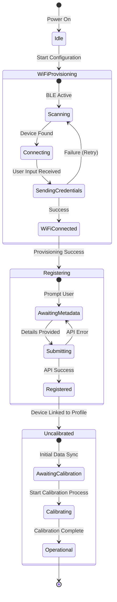

```mermaid
stateDiagram-v2
    [*] --> Idle: Power On
    
    Idle --> WiFiProvisioning: Start Configuration
    
    state WiFiProvisioning {
        [*] --> Scanning: BLE Active
        Scanning --> Connecting: Device Found
        Connecting --> SendingCredentials: User Input Received
        SendingCredentials --> WiFiConnected: Success
        SendingCredentials --> Scanning: Failure (Retry)
    }

    WiFiConnected --> Registering: Provisioning Success
    
    
    state Registering {
        [*] --> AwaitingMetadata: Prompt User
        AwaitingMetadata --> Submitting: Details Provided
        Submitting --> Registered: API Success
        Submitting --> AwaitingMetadata: API Error
    }

    Registered --> Uncalibrated: Device Linked to Profile
    
    state Uncalibrated {
        [*] --> AwaitingCalibration: Initial Data Sync
        AwaitingCalibration --> Calibrating: Start Calibration Process
        Calibrating --> Operational: Calibration Complete
    }

    Operational --> [*]
```