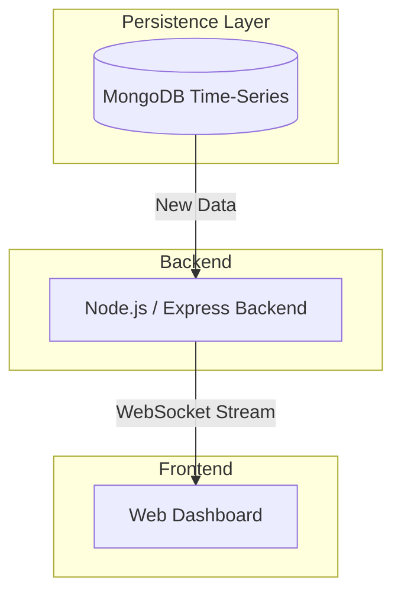

# Software
## Authentication and Authorization 
The EMS uses JSON Web Tokens (JWT) for secure authentication and authorization. Firebase Authentication is integrated as the primary service for managing user identities and access control.

## MQTT 
The MQTT (Message Queuing Telemetry Transport) protocol is used for lightweight, publish-subscribe messaging, primarily for communication between the ESP32 microcontrollers and the backend. The system utilizes Mosquitto as the MQTT broker, which is an open-source message broker that implements the MQTT protocol versions 3.1 and 3.1.1. It is known for its efficiency and reliability in IoT environments.

## Websockets 
WebSockets provide a full-duplex communication channel over a single TCP connection, enabling real-time, bidirectional data exchange between a client and a server. Unlike traditional HTTP requests, WebSockets maintain an open connection, allowing both parties to send data at any time without the overhead of establishing new connections for each message.

In the EMS, the backend (Node.js/Express) uses the `ws` package to implement the WebSocket server. The frontend (Next.js Webapp) utilizes the native WebSocket API or a client-side library to establish and manage WebSocket connections.

## Realtime Data-sending mechanism

The EMS utilizes WebSockets for real-time, bidirectional communication between the backend and the frontend. This allows for instant updates to the web dashboard as new sensor data arrives.

### Device to Backend to Frontend Flow

1.  **ESP32 to Backend:** ESP32 microcontrollers send telemetry data to the Node.js/Express backend, typically via MQTT or direct HTTP/WebSocket connections (depending on configuration).
2.  **Backend Processing:** The backend processes this data and stores it in MongoDB (time-series database).
3.  **Real-time Update:** When new data is stored, the backend pushes it to connected frontend clients via WebSockets.

