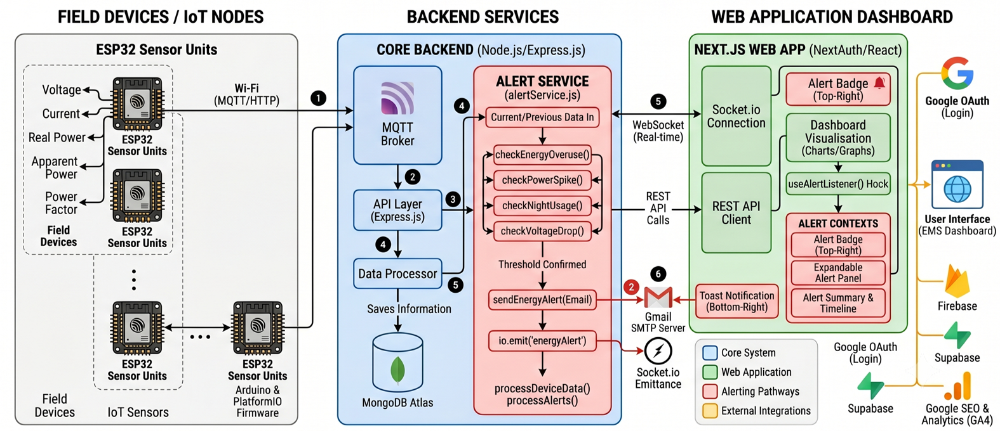

# System Architecture

The Energy Monitoring System (EMS) is a full-stack IoT platform integrating custom hardware sensors, cloud database storage, and a real-time responsive web dashboard.

---

## 🏗️ Architecture Diagram

Below is the high-level system diagram showing data flows from physical current and voltage sensors to the end-user interface.


---

## ⚡ Hardware Components

### 1. ESP32 Microcontroller

- Responsible for sampling raw analog signals from the sensors.
- Performs root-mean-square (RMS) computations locally.
- Sends processed telemetry data over local WiFi.

### 2. SCT-013 Current Clamp Sensor 

- Non-invasive split-core current transformer.
- Measures alternating current (up to 100A).
- Interfaced via an analog burden resistor circuit to translate current ratios into ADC-readable voltage.

### 3. ACS712 Hall Effect Sensor

- Measures AC/DC current based on the Hall effect.
- Provides an analog voltage output proportional to the current.

### 4. ZMPT101B Voltage Sensor

- Active single-phase AC voltage transformer module.
- Safely steps down high-voltage AC mains to low-voltage AC.
- Incorporates a trim potentiometer for calibrating the output amplitude.

### 4. Power Line Communication (PLC) Module
- ***

## 💾 Database Schema

The EMS uses a hybrid database setup to optimize for both transactional consistency and high-frequency sensor streams:

### Supabase / PostgreSQL (Transactional & Auth)

Stores user accounts, system configuration, alert thresholds, and aggregated historical summaries (daily/monthly totals).

### MongoDB (Time-Series Metrics)

Stores raw, high-frequency telemetry samples:

```json
{
  "device_id": "ems-esp-dcb1f6641d44",
  "voltage": 232.2,
  "current": 1.466,
  "apparent_power": 737,
  "real_power": 523,
  "power_factor": 0.98
}
```
